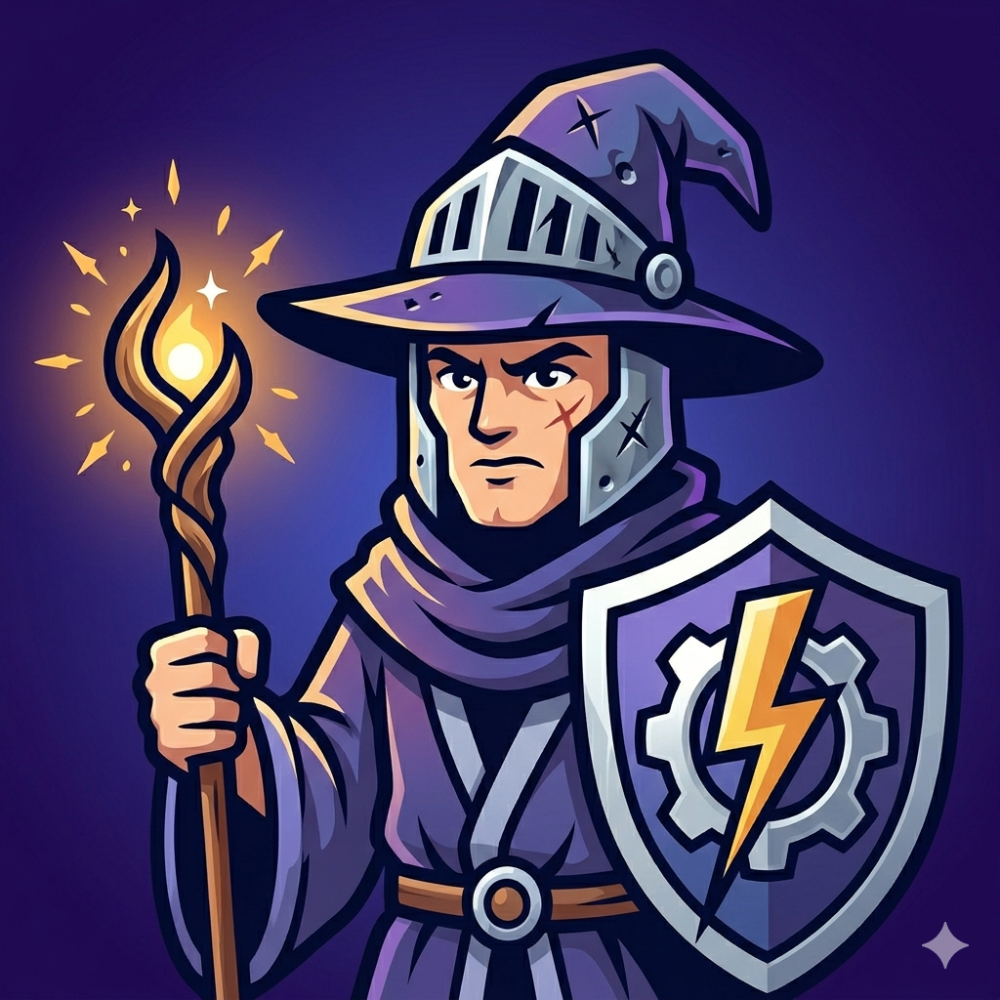

# Battle Mage (@bm)

A Slack agent powered by Claude AI that answers questions about your GitHub codebase. Mention `@bm` in any channel and ask about code, architecture, issues, or pull requests.



## Features

- **Code intelligence** — searches and reads your repo to answer with specific file paths and line numbers
- **Issue and PR awareness** — lists recent issues, PRs, and commits sorted by date
- **Issue creation** — drafts issues with a preview; creates only after ✅ reaction
- **Thread conversations** — follow up without re-mentioning the bot
- **Persistent knowledge base** — remembers corrections across conversations (Vercel KV)
- **Repo index** — auto-built topic map for fast navigation, rebuilt lazily on push
- **Source-of-truth hierarchy** — weights code over docs over KB when sources conflict
- **Auto-correction** — removes stale knowledge entries when answers get 👎
- **Live progress** — shows what the agent is doing step by step with contextual emoji
- **Recency-first** — prefers recent commits, PRs, and issues over historical data

## Quick Start

```bash
git clone <your-fork-url>
cd battle-mage
npm install
cp .env.example .env.local  # Fill in credentials
npm run dev
```

See the [full setup guide](docs/setup.md) for Slack app creation, GitHub PAT, Vercel deployment, and first-run testing.

## Documentation

| Guide | What it covers |
|-------|---------------|
| [Setup](docs/setup.md) | Slack app, GitHub PAT, Vercel deploy, env vars |
| [Usage](docs/usage.md) | Asking questions, threads, issues, corrections, feedback |
| [Architecture](docs/architecture.md) | Agent loop, tools, system prompt, design decisions |
| [Contributing](docs/contributing.md) | Fork workflow, TDD, CI, branch protection |
| [Troubleshooting](docs/troubleshooting.md) | Common issues and fixes |

### Feature Deep-Dives

| Feature | Doc |
|---------|-----|
| Repo Index | [docs/features/repo-index.md](docs/features/repo-index.md) |
| Knowledge Base | [docs/features/knowledge-base.md](docs/features/knowledge-base.md) |
| Source-of-Truth Hierarchy | [docs/features/source-hierarchy.md](docs/features/source-hierarchy.md) |
| Auto-Correction on 👎 | [docs/features/auto-correction.md](docs/features/auto-correction.md) |
| Live Progress Updates | [docs/features/progress-ux.md](docs/features/progress-ux.md) |

## Environment Variables

| Variable | Description |
|----------|-------------|
| `SLACK_BOT_TOKEN` | Bot User OAuth Token (`xoxb-...`) |
| `SLACK_SIGNING_SECRET` | Slack app signing secret |
| `ANTHROPIC_API_KEY` | Claude API key |
| `GITHUB_PAT_BM` | Fine-grained PAT scoped to your target repo |
| `GITHUB_OWNER` | GitHub org or username |
| `GITHUB_REPO` | Repository name |

## How It Works

```
User @mentions @bm in Slack
  → Webhook received, ack'd within 3 seconds
  → Live progress: 🧠 → 🔍 → 👓 → ✏️
  → Claude reads code, issues, PRs via GitHub API
  → Answer posted in thread, progress message deleted
```

For the full architecture walkthrough, see [docs/architecture.md](docs/architecture.md).

## Testing

```bash
npm test              # 100 tests across 7 files
npm run test:watch    # Watch mode
npm run typecheck     # TypeScript strict
```

TDD is mandatory for all new features. See [docs/contributing.md](docs/contributing.md).

## License

MIT
